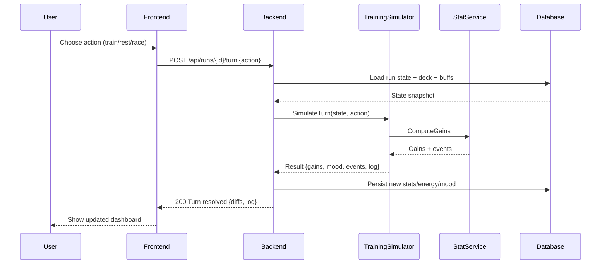

# SEQ-002: Training Block Resolution

## Umamusume Pretty Derby Career Planner

**Document Version**: 1.0  
**Date**: January 14, 2026  
**Related Documents**: [PRD-001], [SPEC-002], [FLOW-002]

---

## Sequence Overview
- Resolves a single turn: fetch context, simulate training/race/rest, apply gains, update mood/energy, persist.

## Sequence Diagram

