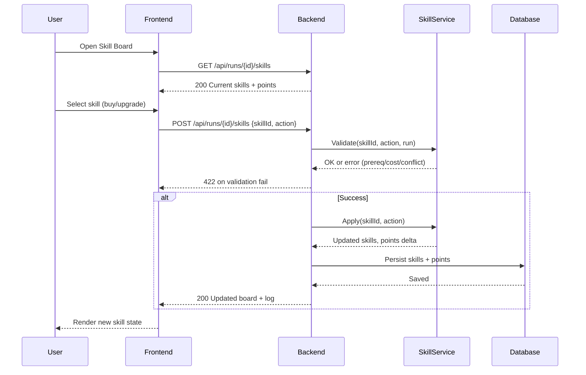

# SEQ-003: Skill Acquisition and Upgrade

## Umamusume Pretty Derby Career Planner

**Document Version**: 1.0  
**Date**: January 14, 2026  
**Related Documents**: [PRD-001], [SPEC-003], [FLOW-004]

---

## Sequence Overview
- User buys or upgrades skills; system validates prerequisites, costs, conflicts, then applies updates.

## Sequence Diagram

