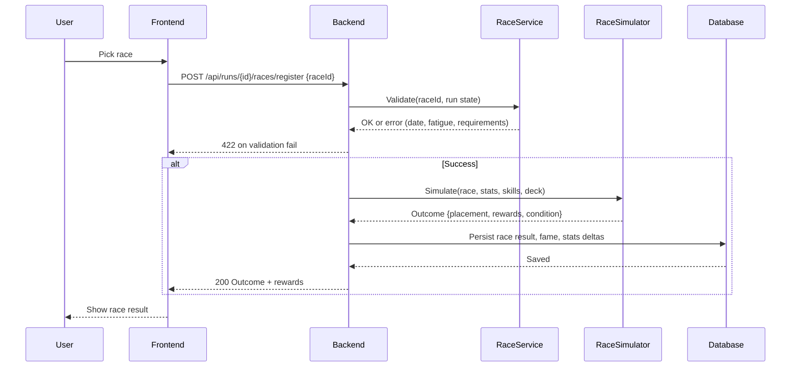

# SEQ-004: Race Registration and Outcome

## Umamusume Pretty Derby Career Planner

**Document Version**: 1.0  
**Date**: January 14, 2026  
**Related Documents**: [PRD-001], [SPEC-004], [FLOW-003]

---

## Sequence Overview
- User registers for a race; system validates schedule/stats, simulates outcome, applies rewards/penalties.

## Sequence Diagram

