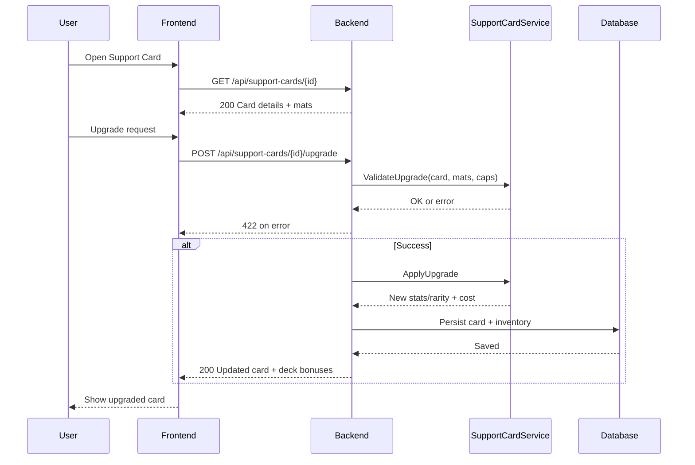

# SEQ-005: Support Card Upgrade

## Umamusume Pretty Derby Career Planner

**Document Version**: 1.0  
**Date**: January 14, 2026  
**Related Documents**: [PRD-001], [SPEC-005], [FLOW-005]

---

## Sequence Overview
- User enhances support card level/rarity; system checks materials/caps, applies upgrade, updates deck bonuses.

## Sequence Diagram

