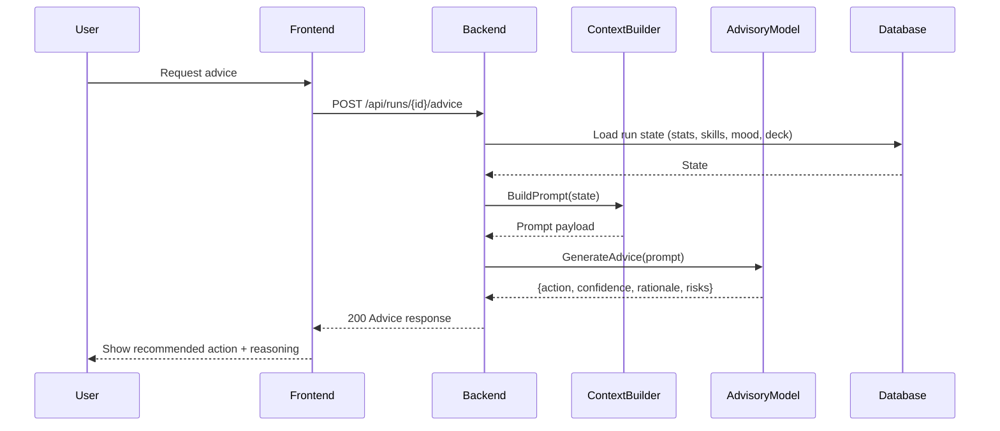

# SEQ-006: AI Advice Generation

## Umamusume Pretty Derby Career Planner

**Document Version**: 1.0  
**Date**: January 14, 2026  
**Related Documents**: [PRD-001], [SPEC-006], [FLOW-006]

---

## Sequence Overview
- User asks for advice; system aggregates context, calls AI, surfaces recommended action and rationale.

## Sequence Diagram

