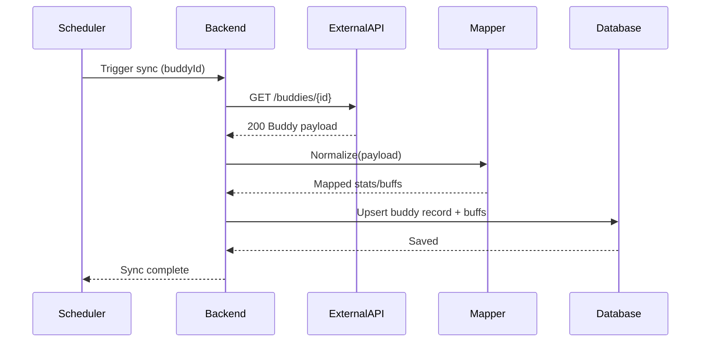

# SEQ-007: External Data Sync (Training Buddy)

## Umamusume Pretty Derby Career Planner

**Document Version**: 1.0  
**Date**: January 14, 2026  
**Related Documents**: [PRD-001], [SPEC-007], [FLOW-007]

---

## Sequence Overview
- Syncs external training buddy stats; system pulls data, normalizes, applies buffs.

## Sequence Diagram

