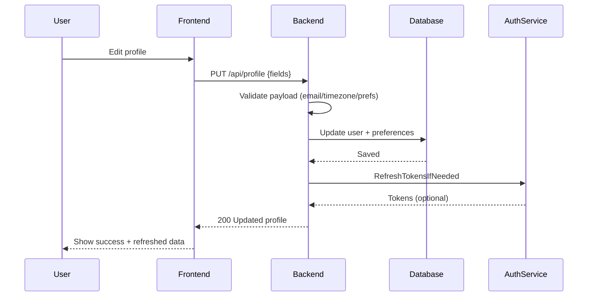

# SEQ-009: User Profile Update

## Umamusume Pretty Derby Career Planner

**Document Version**: 1.0  
**Date**: January 14, 2026  
**Related Documents**: [PRD-001], [SPEC-009]

---

## Sequence Overview
- User updates profile settings; system validates, persists, and refreshes sessions where needed.

## Sequence Diagram

