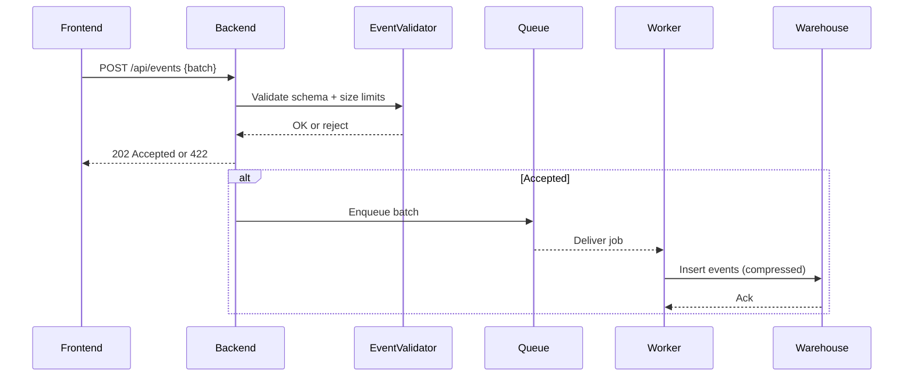

# SEQ-011: Telemetry Event Capture

## Umamusume Pretty Derby Career Planner

**Document Version**: 1.0  
**Date**: January 14, 2026  
**Related Documents**: [PRD-001], [SPEC-011]

---

## Sequence Overview
- Captures client events, validates schema, batches, and stores for analytics.

## Sequence Diagram

