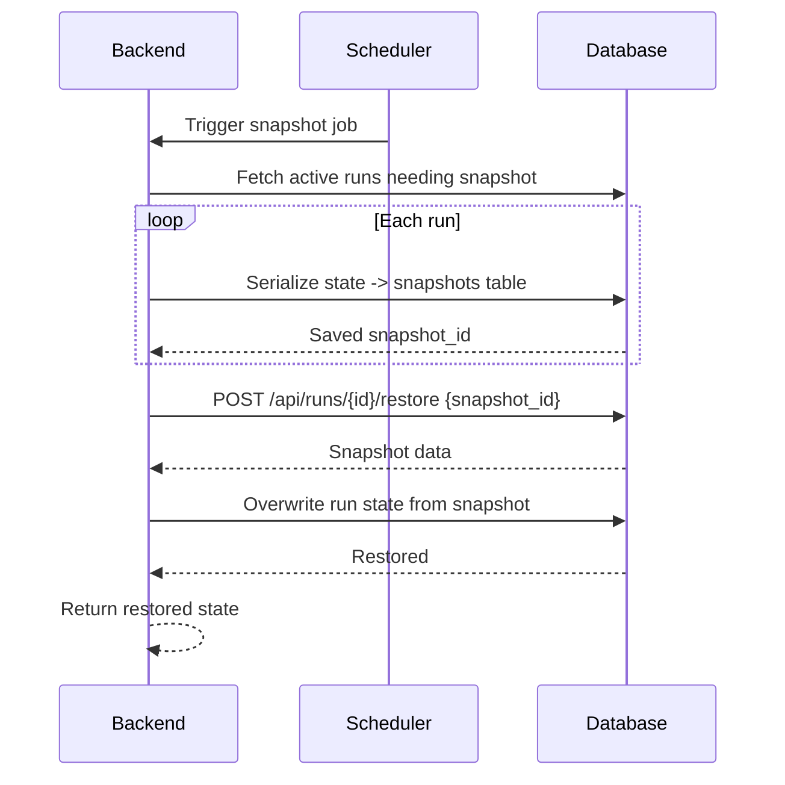

# SEQ-012: Run Snapshot and Restore

## Umamusume Pretty Derby Career Planner

**Document Version**: 1.0  
**Date**: January 14, 2026  
**Related Documents**: [PRD-001], [SPEC-012]

---

## Sequence Overview
- Saves periodic run snapshots and restores on request for what-if scenarios or rollback.

## Sequence Diagram

