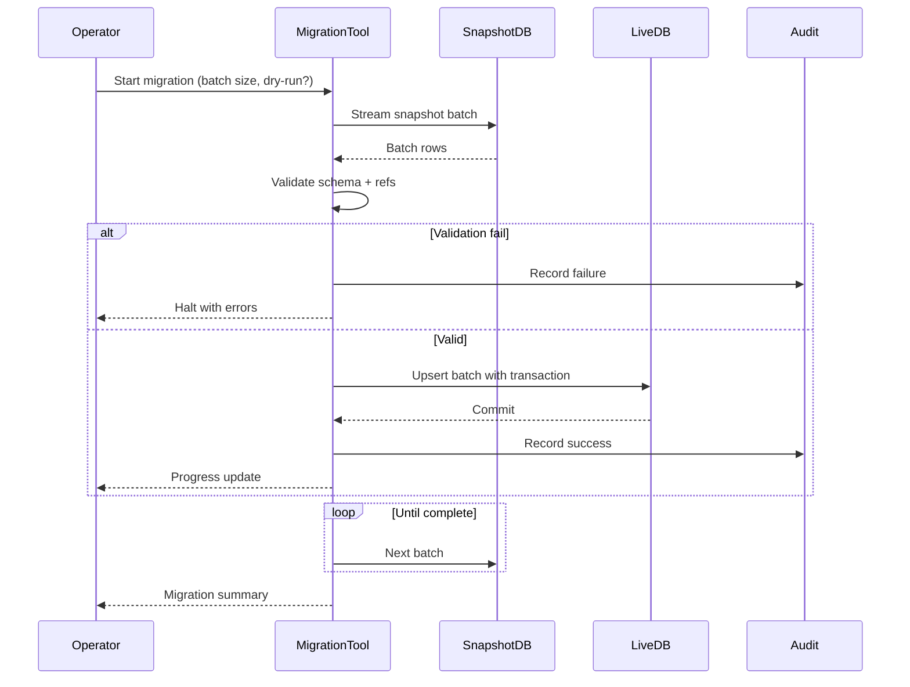

# SEQ-015: Data Migration (Snapshot to Live)

## Umamusume Pretty Derby Career Planner

**Document Version**: 1.0  
**Date**: January 14, 2026  
**Related Documents**: [PRD-001], [SPEC-015], [005_DMP_Data_Migration_Plan.md]

---

## Sequence Overview
- Migrates snapshot data into live tables with validation, chunking, and audit logging.

## Sequence Diagram

