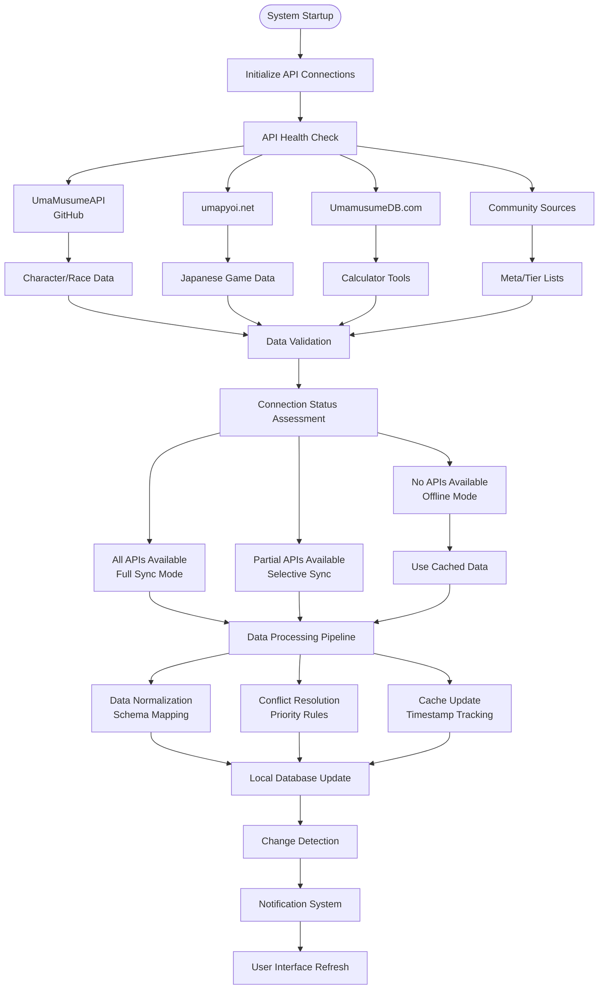
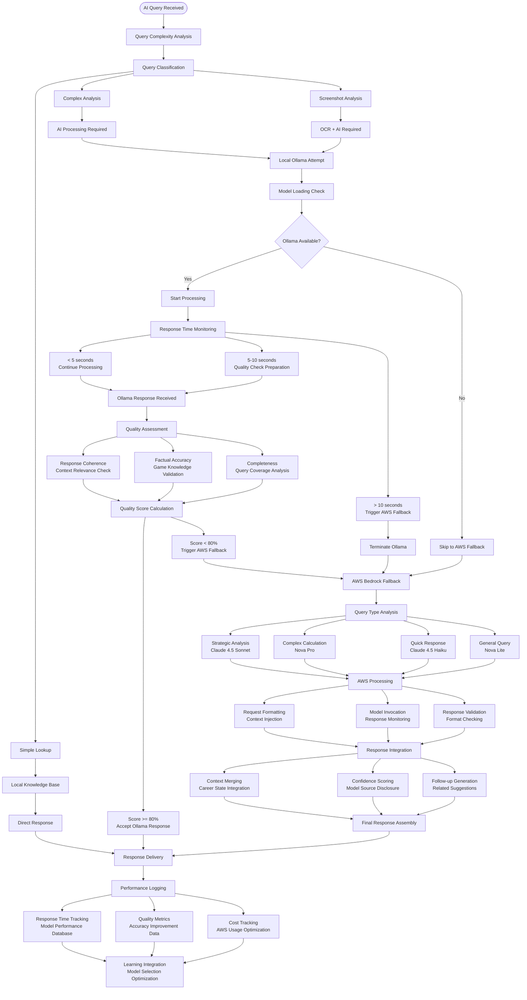
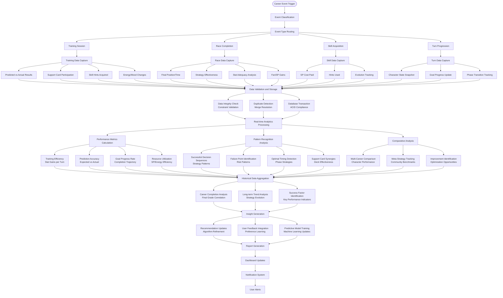

# Umamusume Career Planner - System Process Flow Diagrams

## Overview

This document presents the system-level process flow diagrams for the Umamusume Pretty Derby Career Planner application, showing how internal processes interact, data flows between components, and system-level decision making. The system is built with **Laravel 12** (released February 24, 2025) with **TypeScript support**, **Tailwind CSS v4** (released January 22, 2025), and integrates with **AWS Bedrock Claude 4.5** models and **AWS Bedrock Nova 2** for AI capabilities, supporting all **60 comprehensive requirements**.

## 1. External Data Integration and Synchronization Flow

### Text Description

The external data integration process manages connections to multiple community APIs, handles data synchronization, caching strategies, and fallback mechanisms when external sources are unavailable. The system primarily integrates with **umapyoi.net** (active public API) and **UmamusumeDB.com** after the deprecation of SimpleSandman/UmaMusumeAPI (EOL October 29, 2024).

### ASCII Diagram

```
[System Startup] -----> [Initialize API Connections]
        |
        v
[API Health Check]
        |
        +-----> [UmaMusumeAPI] -----> [Character/Race Data]
        |       (GitHub)                    |
        |                                   v
        +-----> [umapyoi.net] -----> [Japanese Game Data] -----> [Data Validation]
        |                                   |                         |
        +-----> [UmamusumeDB.com] -----> [Calculator Tools] ----------+
        |                                   |                         |
        +-----> [Community Sources] -----> [Meta/Tier Lists] ---------+
        |                                                             |
        v                                                             v
[Connection Status Assessment] <--------------------------------------+
        |
        +-----> [All APIs Available] -----> [Full Sync Mode]
        |                                        |
        +-----> [Partial APIs Available] -----> [Selective Sync]
        |                                        |
        +-----> [No APIs Available] -----> [Offline Mode] -----> [Use Cached Data]
        |                                        |
        v                                        v
[Data Processing Pipeline] <---------------------+
        |
        +-----> [Data Normalization] -----> [Schema Mapping]
        |
        +-----> [Conflict Resolution] -----> [Priority Rules]
        |
        +-----> [Cache Update] -----> [Timestamp Tracking]
        |
        v
[Local Database Update] -----> [Change Detection]
        |                            |
        v                            v
[Notification System] <--------------+
        |
        v
[User Interface Refresh]
```

### Mermaid Diagram



## 2. Training Optimization Engine Process Flow

### Text Description

The core optimization engine that processes character state, analyzes training options, calculates predictions, and generates recommendations using multiple algorithms and data sources. Built with **Laravel 12** backend and enhanced by **AWS Bedrock** AI models for intelligent decision making.

### ASCII Diagram

```
[Training Request] -----> [Character State Analysis]
        |
        v
[Data Collection]
        |
        +-----> [Current Stats] -----> [Stat Progression Analysis]
        |
        +-----> [Support Cards] -----> [Friendship Levels Check]
        |
        +-----> [Energy/Mood] -----> [Risk Assessment]
        |
        +-----> [Conditions] -----> [Impact Calculation]
        |
        +-----> [Turn Context] -----> [Career Phase Analysis]
        |
        v
[Training Options Evaluation]
        |
        +-----> [Speed Training] -----> [Stat Gain Calculation]
        |                                    |
        +-----> [Stamina Training] -----> [Support Participation] -----> [Friendship Bonus]
        |                                    |                              |
        +-----> [Power Training] -----> [Skill Hint Probability] -----> [SP Value Analysis]
        |                                    |                              |
        +-----> [Guts Training] -----> [Red "!" Detection] -----> [Guaranteed Hints]
        |                                    |                              |
        +-----> [Wit Training] -----> [Energy Recovery Bonus] -------------+
        |                                    |                              |
        +-----> [Rest] -----> [Energy Restoration] -------------------------+
        |                                    |                              |
        +-----> [Recreation] -----> [Mood Improvement] ---------------------+
        |                                                                   |
        v                                                                   v
[Optimization Algorithms] <-------------------------------------------------+
        |
        +-----> [Goal Priority Weighting] -----> [Distance-Specific Requirements]
        |
        +-----> [Turn Economy Analysis] -----> [Remaining Turns vs Goals]
        |
        +-----> [Risk-Reward Calculation] -----> [Failure Probability vs Benefit]
        |
        +-----> [Long-term Impact Assessment] -----> [Career Trajectory Modeling]
        |
        v
[Recommendation Scoring]
        |
        +-----> [Primary Option] -----> [Highest Expected Value]
        |
        +-----> [Alternative Options] -----> [Risk-Adjusted Alternatives]
        |
        +-----> [Risk Warnings] -----> [Failure Probability Alerts]
        |
        v
[Output Generation] -----> [Formatted Recommendations]
        |
        v
[Prediction Logging] -----> [Accuracy Tracking Database]
```

### Mermaid Diagram

```mermaid
flowchart TD
    TrainingRequest([Training Request]) --> CharacterStateAnalysis[Character State Analysis]
    CharacterStateAnalysis --> DataCollection[Data Collection]
    
    DataCollection --> CurrentStats[Current Stats]
    DataCollection --> SupportCards[Support Cards]
    DataCollection --> EnergyMood[Energy/Mood]
    DataCollection --> Conditions[Conditions]
    DataCollection --> TurnContext[Turn Context]
    
    CurrentStats --> StatProgression[Stat Progression Analysis]
    SupportCards --> FriendshipCheck[Friendship Levels Check]
    EnergyMood --> RiskAssessment[Risk Assessment]
    Conditions --> ImpactCalculation[Impact Calculation]
    TurnContext --> CareerPhaseAnalysis[Career Phase Analysis]
    
    StatProgression --> TrainingOptionsEval[Training Options Evaluation]
    FriendshipCheck --> TrainingOptionsEval
    RiskAssessment --> TrainingOptionsEval
    ImpactCalculation --> TrainingOptionsEval
    CareerPhaseAnalysis --> TrainingOptionsEval
    
    TrainingOptionsEval --> SpeedTraining[Speed Training]
    TrainingOptionsEval --> StaminaTraining[Stamina Training]
    TrainingOptionsEval --> PowerTraining[Power Training]
    TrainingOptionsEval --> GutsTraining[Guts Training]
    TrainingOptionsEval --> WitTraining[Wit Training]
    TrainingOptionsEval --> Rest[Rest]
    TrainingOptionsEval --> Recreation[Recreation]
    
    SpeedTraining --> StatGainCalc[Stat Gain Calculation]
    StaminaTraining --> SupportParticipation[Support Participation]
    PowerTraining --> SkillHintProb[Skill Hint Probability]
    GutsTraining --> RedExclamation[Red "!" Detection]
    WitTraining --> EnergyRecoveryBonus[Energy Recovery Bonus]
    Rest --> EnergyRestoration[Energy Restoration]
    Recreation --> MoodImprovement[Mood Improvement]
    
    SupportParticipation --> FriendshipBonus[Friendship Bonus]
    SkillHintProb --> SPValueAnalysis[SP Value Analysis]
    RedExclamation --> GuaranteedHints[Guaranteed Hints]
    
    StatGainCalc --> OptimizationAlgorithms[Optimization Algorithms]
    FriendshipBonus --> OptimizationAlgorithms
    SPValueAnalysis --> OptimizationAlgorithms
    GuaranteedHints --> OptimizationAlgorithms
    EnergyRecoveryBonus --> OptimizationAlgorithms
    EnergyRestoration --> OptimizationAlgorithms
    MoodImprovement --> OptimizationAlgorithms
    
    OptimizationAlgorithms --> GoalPriorityWeighting[Goal Priority Weighting]
    OptimizationAlgorithms --> TurnEconomyAnalysis[Turn Economy Analysis]
    OptimizationAlgorithms --> RiskRewardCalc[Risk-Reward Calculation]
    OptimizationAlgorithms --> LongTermImpact[Long-term Impact Assessment]
    
    GoalPriorityWeighting --> DistanceRequirements[Distance-Specific Requirements]
    TurnEconomyAnalysis --> RemainingTurnsGoals[Remaining Turns vs Goals]
    RiskRewardCalc --> FailureProbBenefit[Failure Probability vs Benefit]
    LongTermImpact --> CareerTrajectory[Career Trajectory Modeling]
    
    DistanceRequirements --> RecommendationScoring[Recommendation Scoring]
    RemainingTurnsGoals --> RecommendationScoring
    FailureProbBenefit --> RecommendationScoring
    CareerTrajectory --> RecommendationScoring
    
    RecommendationScoring --> PrimaryOption[Primary Option<br/>Highest Expected Value]
    RecommendationScoring --> AlternativeOptions[Alternative Options<br/>Risk-Adjusted Alternatives]
    RecommendationScoring --> RiskWarnings[Risk Warnings<br/>Failure Probability Alerts]
    
    PrimaryOption --> OutputGeneration[Output Generation]
    AlternativeOptions --> OutputGeneration
    RiskWarnings --> OutputGeneration
    
    OutputGeneration --> FormattedRecommendations[Formatted Recommendations]
    FormattedRecommendations --> PredictionLogging[Prediction Logging]
    PredictionLogging --> AccuracyTracking[Accuracy Tracking Database]
```

## 3. AI Model Selection and Fallback Process Flow

### Text Description

The intelligent AI system that manages model selection between local **Ollama** and cloud **AWS Bedrock** services, handles fallback scenarios, and optimizes response quality and performance. The system uses **Claude 4.5** models (Opus: $5/$25 per 1M tokens, Sonnet: $3/$15, Haiku: $1/$5) and **Nova 2** models (Lite: $0.00125 per 1K tokens, Pro: Preview) for different complexity levels.

### ASCII Diagram

```
[AI Query Received] -----> [Query Complexity Analysis]
        |
        v
[Query Classification]
        |
        +-----> [Simple Lookup] -----> [Local Knowledge Base] -----> [Direct Response]
        |
        +-----> [Complex Analysis] -----> [AI Processing Required]
        |
        +-----> [Screenshot Analysis] -----> [OCR + AI Required]
        |
        v
[Local Ollama Attempt]
        |
        +-----> [Model Loading Check] -----> [Ollama Available?]
        |                                        |
        |                                        +-----> [Yes] -----> [Start Processing]
        |                                        |                         |
        |                                        +-----> [No] -----> [Skip to AWS Fallback]
        |                                                                   |
        v                                                                   |
[Response Time Monitoring] <------------------------------------------------+
        |
        +-----> [< 5 seconds] -----> [Continue Processing]
        |                                   |
        +-----> [5-10 seconds] -----> [Quality Check Preparation]
        |                                   |
        +-----> [> 10 seconds] -----> [Trigger AWS Fallback] -----> [Terminate Ollama]
        |                                                                   |
        v                                                                   |
[Ollama Response Received] <------------------------------------------------+
        |
        v
[Quality Assessment]
        |
        +-----> [Response Coherence] -----> [Context Relevance Check]
        |
        +-----> [Factual Accuracy] -----> [Game Knowledge Validation]
        |
        +-----> [Completeness] -----> [Query Coverage Analysis]
        |
        v
[Quality Score Calculation]
        |
        +-----> [Score >= 80%] -----> [Accept Ollama Response] -----> [Response Delivery]
        |
        +-----> [Score < 80%] -----> [Trigger AWS Fallback]
        |
        v
[AWS Bedrock Fallback]
        |
        +-----> [Query Type Analysis]
        |       |
        |       +-----> [Strategic Analysis] -----> [Claude 4.5 Sonnet]
        |       |
        |       +-----> [Complex Calculation] -----> [Nova Pro]
        |       |
        |       +-----> [Quick Response] -----> [Claude 4.5 Haiku]
        |       |
        |       +-----> [General Query] -----> [Nova Lite]
        |
        v
[AWS Processing]
        |
        +-----> [Request Formatting] -----> [Context Injection]
        |
        +-----> [Model Invocation] -----> [Response Monitoring]
        |
        +-----> [Response Validation] -----> [Format Checking]
        |
        v
[Response Integration]
        |
        +-----> [Context Merging] -----> [Career State Integration]
        |
        +-----> [Confidence Scoring] -----> [Model Source Disclosure]
        |
        +-----> [Follow-up Generation] -----> [Related Suggestions]
        |
        v
[Final Response Assembly] -----> [Response Delivery]
        |
        v
[Performance Logging]
        |
        +-----> [Response Time Tracking] -----> [Model Performance Database]
        |
        +-----> [Quality Metrics] -----> [Accuracy Improvement Data]
        |
        +-----> [Cost Tracking] -----> [AWS Usage Optimization]
        |
        v
[Learning Integration] -----> [Model Selection Optimization]
```

### Mermaid Diagram



## 4. Career Data Management and Analytics Process Flow

### Text Description

The comprehensive data management system that handles career progression tracking, historical analysis, performance metrics calculation, and pattern recognition for optimization improvements.

### ASCII Diagram

```
[Career Event Trigger] -----> [Event Classification]
        |
        v
[Event Type Routing]
        |
        +-----> [Training Session] -----> [Training Data Capture]
        |                                      |
        |                                      +-----> [Predicted vs Actual Results]
        |                                      +-----> [Support Card Participation]
        |                                      +-----> [Skill Hints Acquired]
        |                                      +-----> [Energy/Mood Changes]
        |
        +-----> [Race Completion] -----> [Race Data Capture]
        |                                     |
        |                                     +-----> [Final Position/Time]
        |                                     +-----> [Strategy Effectiveness]
        |                                     +-----> [Stat Adequacy Analysis]
        |                                     +-----> [Fan/SP Gains]
        |
        +-----> [Skill Acquisition] -----> [Skill Data Capture]
        |                                       |
        |                                       +-----> [SP Cost Paid]
        |                                       +-----> [Hints Used]
        |                                       +-----> [Evolution Tracking]
        |
        +-----> [Turn Progression] -----> [Turn Data Capture]
        |                                      |
        |                                      +-----> [Character State Snapshot]
        |                                      +-----> [Goal Progress Update]
        |                                      +-----> [Phase Transition Tracking]
        |
        v
[Data Validation and Storage]
        |
        +-----> [Data Integrity Check] -----> [Constraint Validation]
        |
        +-----> [Duplicate Detection] -----> [Merge Resolution]
        |
        +-----> [Database Transaction] -----> [ACID Compliance]
        |
        v
[Real-time Analytics Processing]
        |
        +-----> [Performance Metrics Calculation]
        |       |
        |       +-----> [Training Efficiency] -----> [Stat Gains per Turn]
        |       +-----> [Prediction Accuracy] -----> [Expected vs Actual]
        |       +-----> [Goal Progress Rate] -----> [Completion Trajectory]
        |       +-----> [Resource Utilization] -----> [SP/Energy Efficiency]
        |
        +-----> [Pattern Recognition Analysis]
        |       |
        |       +-----> [Successful Decision Sequences] -----> [Strategy Patterns]
        |       +-----> [Failure Point Identification] -----> [Risk Patterns]
        |       +-----> [Optimal Timing Detection] -----> [Phase Strategies]
        |       +-----> [Support Card Synergies] -----> [Deck Effectiveness]
        |
        +-----> [Comparative Analysis]
        |       |
        |       +-----> [Multi-Career Comparison] -----> [Character Performance]
        |       +-----> [Meta Strategy Tracking] -----> [Community Benchmarks]
        |       +-----> [Improvement Identification] -----> [Optimization Opportunities]
        |
        v
[Historical Data Aggregation]
        |
        +-----> [Career Completion Analysis] -----> [Final Grade Correlation]
        |
        +-----> [Long-term Trend Analysis] -----> [Strategy Evolution]
        |
        +-----> [Success Factor Identification] -----> [Key Performance Indicators]
        |
        v
[Insight Generation]
        |
        +-----> [Recommendation Updates] -----> [Algorithm Refinement]
        |
        +-----> [User Feedback Integration] -----> [Preference Learning]
        |
        +-----> [Predictive Model Training] -----> [Machine Learning Updates]
        |
        v
[Report Generation] -----> [Dashboard Updates]
        |
        v
[Notification System] -----> [User Alerts]
```

### Mermaid Diagram



## 5. Error Handling and Recovery Process Flow

### Text Description

The comprehensive error handling system that manages failures, implements recovery strategies, maintains system stability, and ensures data integrity across all system components.

### ASCII Diagram

```
[System Operation] -----> [Error Detection]
        |
        v
[Error Classification]
        |
        +-----> [API Connection Error] -----> [Network Failure Handling]
        |                                          |
        |                                          +-----> [Retry Logic] -----> [Exponential Backoff]
        |                                          +-----> [Fallback to Cache] -----> [Offline Mode]
        |                                          +-----> [User Notification] -----> [Status Update]
        |
        +-----> [Database Error] -----> [Data Integrity Protection]
        |                                    |
        |                                    +-----> [Transaction Rollback] -----> [Consistency Check]
        |                                    +-----> [Backup Restoration] -----> [Data Recovery]
        |                                    +-----> [Connection Pool Reset] -----> [Reconnection]
        |
        +-----> [AI Model Error] -----> [Model Fallback Handling]
        |                                    |
        |                                    +-----> [Ollama Failure] -----> [AWS Fallback]
        |                                    +-----> [AWS Rate Limit] -----> [Request Queuing]
        |                                    +-----> [Model Timeout] -----> [Response Caching]
        |
        +-----> [OCR Processing Error] -----> [Image Analysis Recovery]
        |                                          |
        |                                          +-----> [Image Quality Check] -----> [Enhancement]
        |                                          +-----> [Alternative OCR Engine] -----> [Backup Processing]
        |                                          +-----> [Manual Input Fallback] -----> [User Assistance]
        |
        +-----> [Calculation Error] -----> [Computation Recovery]
        |                                       |
        |                                       +-----> [Input Validation] -----> [Sanitization]
        |                                       +-----> [Algorithm Fallback] -----> [Simplified Calculation]
        |                                       +-----> [Default Values] -----> [Safe Defaults]
        |
        v
[Recovery Strategy Selection]
        |
        +-----> [Immediate Recovery] -----> [Automatic Retry]
        |                                        |
        |                                        +-----> [Success] -----> [Resume Operation]
        |                                        +-----> [Failure] -----> [Escalate to Manual]
        |
        +-----> [Graceful Degradation] -----> [Reduced Functionality]
        |                                           |
        |                                           +-----> [Core Features Only] -----> [Essential Operations]
        |                                           +-----> [Cached Data Usage] -----> [Limited Updates]
        |                                           +-----> [User Notification] -----> [Status Explanation]
        |
        +-----> [System Restart] -----> [Component Isolation]
        |                                     |
        |                                     +-----> [Service Restart] -----> [Health Check]
        |                                     +-----> [Cache Clearing] -----> [Fresh Start]
        |                                     +-----> [Configuration Reset] -----> [Default Settings]
        |
        v
[Error Logging and Analysis]
        |
        +-----> [Error Details Capture] -----> [Stack Trace/Context]
        |
        +-----> [Frequency Analysis] -----> [Pattern Detection]
        |
        +-----> [Impact Assessment] -----> [Severity Classification]
        |
        +-----> [Root Cause Analysis] -----> [Prevention Strategies]
        |
        v
[System Health Monitoring]
        |
        +-----> [Performance Metrics] -----> [Response Time Tracking]
        |
        +-----> [Resource Usage] -----> [Memory/CPU Monitoring]
        |
        +-----> [Error Rate Tracking] -----> [Trend Analysis]
        |
        +-----> [User Impact Assessment] -----> [Experience Metrics]
        |
        v
[Preventive Measures Implementation]
        |
        +-----> [Code Improvements] -----> [Bug Fixes]
        |
        +-----> [Infrastructure Upgrades] -----> [Capacity Planning]
        |
        +-----> [Monitoring Enhancements] -----> [Early Warning Systems]
        |
        +-----> [Documentation Updates] -----> [Troubleshooting Guides]
        |
        v
[Recovery Verification] -----> [System Stability Check]
        |
        v
[User Communication] -----> [Status Updates]
```

### Mermaid Diagram



```mermaid
flowchart TD
    SystemOperation([System Operation]) --> ErrorDetection[Error Detection]
    ErrorDetection --> ErrorClassification[Error Classification]
    
    ErrorClassification --> APIConnectionError[API Connection Error]
    ErrorClassification --> DatabaseError[Database Error]
    ErrorClassification --> AIModelError[AI Model Error]
    ErrorClassification --> OCRProcessingError[OCR Processing Error]
    ErrorClassification --> CalculationError[Calculation Error]
    
    APIConnectionError --> NetworkFailureHandling[Network Failure Handling]
    NetworkFailureHandling --> RetryLogic[Retry Logic<br/>Exponential Backoff]
    NetworkFailureHandling --> FallbackToCache[Fallback to Cache<br/>Offline Mode]
    NetworkFailureHandling --> UserNotification1[User Notification<br/>Status Update]
    
    DatabaseError --> DataIntegrityProtection[Data Integrity Protection]
    DataIntegrityProtection --> TransactionRollback[Transaction Rollback<br/>Consistency Check]
    DataIntegrityProtection --> BackupRestoration[Backup Restoration<br/>Data Recovery]
    DataIntegrityProtection --> ConnectionPoolReset[Connection Pool Reset<br/>Reconnection]
    
    AIModelError --> ModelFallbackHandling[Model Fallback Handling]
    ModelFallbackHandling --> OllamaFailure[Ollama Failure<br/>AWS Fallback]
    ModelFallbackHandling --> AWSRateLimit[AWS Rate Limit<br/>Request Queuing]
    ModelFallbackHandling --> ModelTimeout[Model Timeout<br/>Response Caching]
    
    OCRProcessingError --> ImageAnalysisRecovery[Image Analysis Recovery]
    ImageAnalysisRecovery --> ImageQualityCheck[Image Quality Check<br/>Enhancement]
    ImageAnalysisRecovery --> AlternativeOCR[Alternative OCR Engine<br/>Backup Processing]
    ImageAnalysisRecovery --> ManualInputFallback[Manual Input Fallback<br/>User Assistance]
    
    CalculationError --> ComputationRecovery[Computation Recovery]
    ComputationRecovery --> InputValidation[Input Validation<br/>Sanitization]
    ComputationRecovery --> AlgorithmFallback[Algorithm Fallback<br/>Simplified Calculation]
    ComputationRecovery --> DefaultValues[Default Values<br/>Safe Defaults]
    
    RetryLogic --> RecoveryStrategySelection[Recovery Strategy Selection]
    FallbackToCache --> RecoveryStrategySelection
    UserNotification1 --> RecoveryStrategySelection
    TransactionRollback --> RecoveryStrategySelection
    BackupRestoration --> RecoveryStrategySelection
    ConnectionPoolReset --> RecoveryStrategySelection
    OllamaFailure --> RecoveryStrategySelection
    AWSRateLimit --> RecoveryStrategySelection
    ModelTimeout --> RecoveryStrategySelection
    ImageQualityCheck --> RecoveryStrategySelection
    AlternativeOCR --> RecoveryStrategySelection
    ManualInputFallback --> RecoveryStrategySelection
    InputValidation --> RecoveryStrategySelection
    AlgorithmFallback --> RecoveryStrategySelection
    DefaultValues --> RecoveryStrategySelection
    
    RecoveryStrategySelection --> ImmediateRecovery[Immediate Recovery]
    RecoveryStrategySelection --> GracefulDegradation[Graceful Degradation]
    RecoveryStrategySelection --> SystemRestart[System Restart]
    
    ImmediateRecovery --> AutomaticRetry[Automatic Retry]
    AutomaticRetry --> RetrySuccess[Success<br/>Resume Operation]
    AutomaticRetry --> RetryFailure[Failure<br/>Escalate to Manual]
    
    GracefulDegradation --> ReducedFunctionality[Reduced Functionality]
    ReducedFunctionality --> CoreFeaturesOnly[Core Features Only<br/>Essential Operations]
    ReducedFunctionality --> CachedDataUsage[Cached Data Usage<br/>Limited Updates]
    ReducedFunctionality --> UserNotification2[User Notification<br/>Status Explanation]
    
    SystemRestart --> ComponentIsolation[Component Isolation]
    ComponentIsolation --> ServiceRestart[Service Restart<br/>Health Check]
    ComponentIsolation --> CacheClearing[Cache Clearing<br/>Fresh Start]
    ComponentIsolation --> ConfigurationReset[Configuration Reset<br/>Default Settings]
    
    RetrySuccess --> ErrorLoggingAnalysis[Error Logging and Analysis]
    RetryFailure --> ErrorLoggingAnalysis
    CoreFeaturesOnly --> ErrorLoggingAnalysis
    CachedDataUsage --> ErrorLoggingAnalysis
    UserNotification2 --> ErrorLoggingAnalysis
    ServiceRestart --> ErrorLoggingAnalysis
    CacheClearing --> ErrorLoggingAnalysis
    ConfigurationReset --> ErrorLoggingAnalysis
    
    ErrorLoggingAnalysis --> ErrorDetailsCapture[Error Details Capture<br/>Stack Trace/Context]
    ErrorLoggingAnalysis --> FrequencyAnalysis[Frequency Analysis<br/>Pattern Detection]
    ErrorLoggingAnalysis --> ImpactAssessment[Impact Assessment<br/>Severity Classification]
    ErrorLoggingAnalysis --> RootCauseAnalysis[Root Cause Analysis<br/>Prevention Strategies]
    
    ErrorDetailsCapture --> SystemHealthMonitoring[System Health Monitoring]
    FrequencyAnalysis --> SystemHealthMonitoring
    ImpactAssessment --> SystemHealthMonitoring
    RootCauseAnalysis --> SystemHealthMonitoring
    
    SystemHealthMonitoring --> PerformanceMetrics[Performance Metrics<br/>Response Time Tracking]
    SystemHealthMonitoring --> ResourceUsage[Resource Usage<br/>Memory/CPU Monitoring]
    SystemHealthMonitoring --> ErrorRateTracking[Error Rate Tracking<br/>Trend Analysis]
    SystemHealthMonitoring --> UserImpactAssessment[User Impact Assessment<br/>Experience Metrics]
    
    PerformanceMetrics --> PreventiveMeasures[Preventive Measures Implementation]
    ResourceUsage --> PreventiveMeasures
    ErrorRateTracking --> PreventiveMeasures
    UserImpactAssessment --> PreventiveMeasures
    
    PreventiveMeasures --> CodeImprovements[Code Improvements<br/>Bug Fixes]
    PreventiveMeasures --> InfrastructureUpgrades[Infrastructure Upgrades<br/>Capacity Planning]
    PreventiveMeasures --> MonitoringEnhancements[Monitoring Enhancements<br/>Early Warning Systems]
    PreventiveMeasures --> DocumentationUpdates[Documentation Updates<br/>Troubleshooting Guides]
    
    CodeImprovements --> RecoveryVerification[Recovery Verification]
    InfrastructureUpgrades --> RecoveryVerification
    MonitoringEnhancements --> RecoveryVerification
    DocumentationUpdates --> RecoveryVerification
    
    RecoveryVerification --> SystemStabilityCheck[System Stability Check]
    SystemStabilityCheck --> UserCommunication[User Communication]
    UserCommunication --> StatusUpdates[Status Updates]
```

## System Process Flow Summary

### Key System Processes

1. **External Data Integration**: Manages API connections, data synchronization, and fallback mechanisms
2. **Training Optimization Engine**: Core algorithm processing with multi-factor analysis and recommendation generation
3. **AI Model Selection**: Intelligent routing between local Ollama and cloud AWS models with quality assessment
4. **Career Data Management**: Comprehensive tracking, analytics, and pattern recognition for continuous improvement
5. **Error Handling and Recovery**: Robust failure management with graceful degradation and automatic recovery

### Critical System Features

- **Fault Tolerance**: Multiple fallback mechanisms ensure system availability
- **Performance Optimization**: Intelligent caching and resource management
- **Data Integrity**: ACID compliance and transaction management
- **Scalability**: Modular architecture supporting growth and enhancement
- **Learning Capability**: Continuous improvement through analytics and pattern recognition

### Integration Architecture

- **API Management**: Centralized external data integration with health monitoring
- **AI Orchestration**: Seamless model switching with performance optimization
- **Data Pipeline**: Real-time processing with historical analysis
- **Error Recovery**: Comprehensive failure handling with user communication
- **Performance Monitoring**: Continuous system health assessment and optimization

These system process flow diagrams provide detailed insight into the internal workings of the Umamusume career planner, ensuring robust, scalable, and maintainable system architecture.
