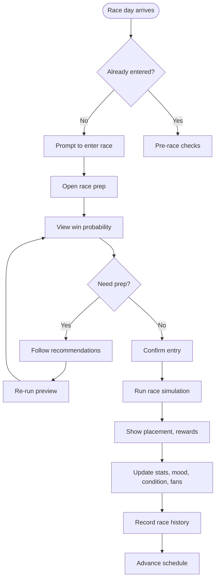

# UF-004: Race Day Flow

## Umamusume Pretty Derby Career Planner

**Document Version**: 1.0  
**Date**: January 14, 2026  
**Related Documents**: [PRD-003], [SPEC-003], [FLOW-003], [SEQ-004], [SEQ-005]

---

## Flow Diagram

## Notes
- If not entered, user must complete prep before simulation.  
- Recommendations include training, skill buys, or rest pre-race.  
- Result includes logs for skill activations and performance.
