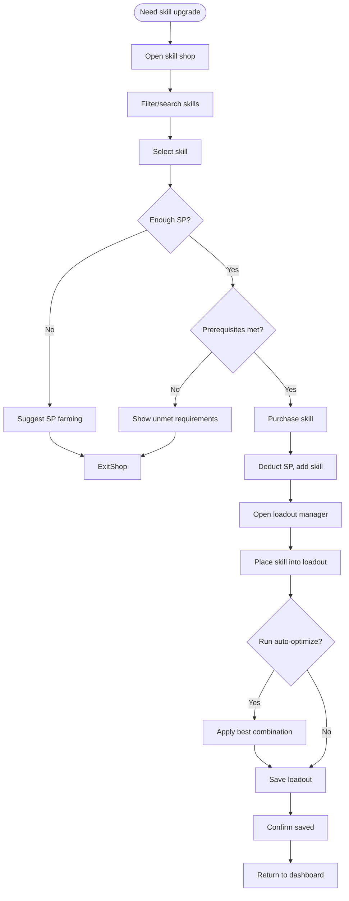

# UF-005: Skill Management Flow

## Umamusume Pretty Derby Career Planner

**Document Version**: 1.0  
**Date**: January 14, 2026  
**Related Documents**: [PRD-004], [SPEC-004], [FLOW-004], [SEQ-006], [SEQ-007]

---

## Flow Diagram

## Notes
- Evolution-capable skills mark prerequisites; unmet shows checklist.  
- Auto-optimize respects SP budget and distance/style coverage.  
- SP suggestions include training choices or race rewards.
