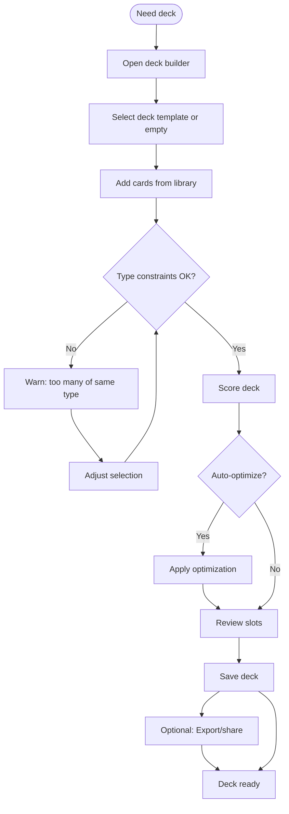

# UF-006: Support Deck Building Flow

## Umamusume Pretty Derby Career Planner

**Document Version**: 1.0  
**Date**: January 14, 2026  
**Related Documents**: [PRD-005], [SPEC-005], [FLOW-005], [SEQ-008], [WF-011]

---

## Flow Diagram

## Notes
- Scoring factors: meta tier, rarity, level/LB, bond, training bonuses.  
- Friend slot indicated separately; cannot exceed slot limit.  
- Export provides share code; import option mirrors flow.
