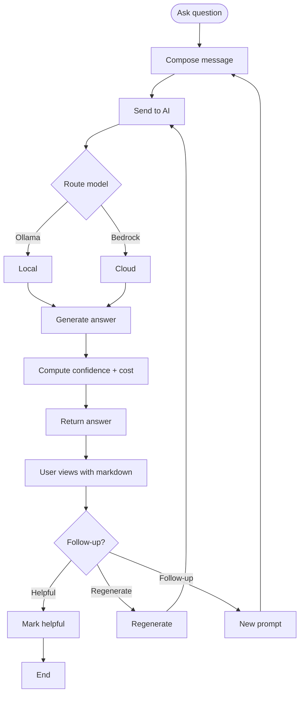

# UF-007: AI Advisor Journey

## Umamusume Pretty Derby Career Planner

**Document Version**: 1.0  
**Date**: January 14, 2026  
**Related Documents**: [PRD-006], [SPEC-006], [FLOW-006], [SEQ-009], [SEQ-015], [WF-012]

---

## Flow Diagram

## Notes
- Context assembled from run data before routing.  
- Budget meter and model badge shown with response.  
- Conversation stored; reconnect replays recent messages.
