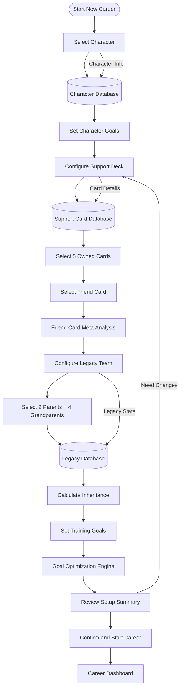
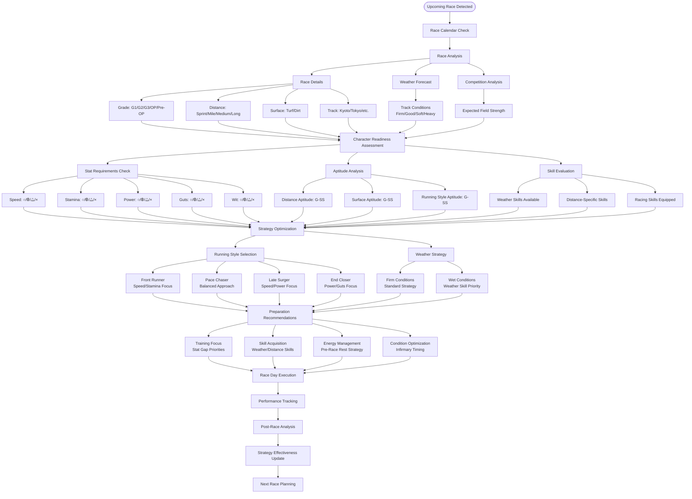
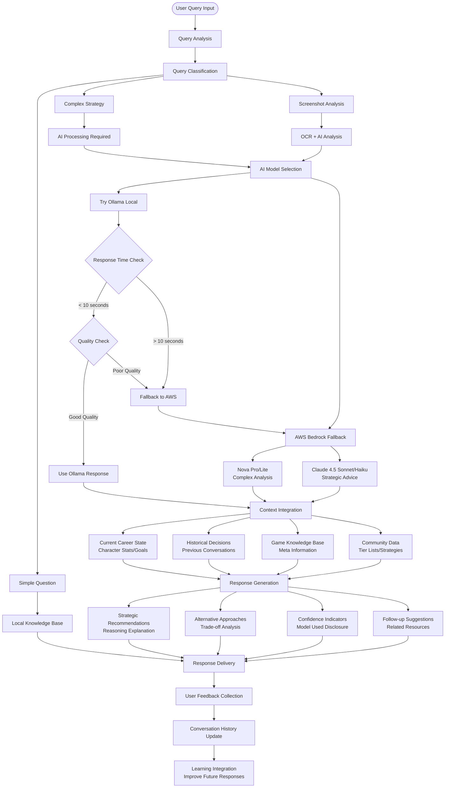

# Umamusume Career Planner - User Workflow Flow Diagrams

## Overview

This document presents the key user workflow flow diagrams for the Umamusume Pretty Derby Career Planner application, showing how users interact with the system to achieve their optimization goals through various pathways and decision points. The system is built with **Laravel 12** (released February 24, 2025) with **TypeScript support**, **Tailwind CSS v4** (released January 22, 2025), and integrates with **AWS Bedrock Claude 4.5** models and **AWS Bedrock Nova 2** for AI capabilities, supporting all **60 comprehensive requirements**.

## 1. Career Setup and Initialization Flow

### Text Description

The career setup flow guides users through the initial configuration of a new career run, including character selection, support card deck composition, legacy character inheritance, and goal setting. This is the foundation workflow that determines the optimization strategy for the entire career, supporting all **60 comprehensive requirements** including advanced PvP team building, resource management, and multi-scenario planning.

### ASCII Diagram

```
[Start New Career]
        |
        v
[Select Character] -----> [Character Database]
        |                        |
        v                        v
[Set Character Goals] <----------+
        |
        v
[Configure Support Deck] -----> [Support Card Database]
        |                              |
        v                              v
[Select 5 Owned Cards] <---------------+
        |
        v
[Select Friend Card] -----> [Friend Card Meta Analysis]
        |                          |
        v                          v
[Configure Legacy Team] <----------+
        |
        v
[Select 2 Parents + 4 Grandparents] -----> [Legacy Database]
        |                                         |
        v                                         v
[Calculate Inheritance] <-------------------------+
        |
        v
[Set Training Goals] -----> [Goal Optimization Engine]
        |                          |
        v                          v
[Review Setup Summary] <-----------+
        |
        v
[Confirm and Start Career]
        |
        v
[Career Dashboard]
```

### Mermaid Diagram



## 2. Turn-by-Turn Training Optimization Flow

### Text Description

The core optimization flow that occurs every turn, analyzing current character state, available training options, support card participation, and providing recommendations based on goals, energy management, and long-term strategy. Enhanced by **AWS Bedrock Claude 4.5** AI models for intelligent decision making and **Laravel 12** backend for robust processing.

### ASCII Diagram

```
[Start Turn] -----> [Current Turn: X/72]
     |
     v
[Analyze Character State]
     |
     +-----> [Stats Analysis] -----> [Goal Progress Check]
     |
     +-----> [Energy Level] -----> [Failure Risk Assessment]
     |
     +-----> [Mood Status] -----> [Training Effectiveness]
     |
     +-----> [Conditions] -----> [Condition Impact Analysis]
     |
     v
[Evaluate Training Options]
     |
     +-----> [Speed Training] -----> [Stat Gain Prediction]
     |
     +-----> [Stamina Training] -----> [Support Card Participation]
     |
     +-----> [Power Training] -----> [Friendship Training Bonus]
     |
     +-----> [Guts Training] -----> [Skill Hint Opportunities]
     |
     +-----> [Wit Training] -----> [Red "!" Indicators]
     |
     +-----> [Rest] -----> [Energy Recovery]
     |
     +-----> [Recreation] -----> [Mood Improvement]
     |
     v
[Optimization Engine Analysis]
     |
     +-----> [Goal Priority Weighting]
     |
     +-----> [Turn Economy Calculation]
     |
     +-----> [Risk-Reward Analysis]
     |
     +-----> [Long-term Strategy Impact]
     |
     v
[Generate Recommendations]
     |
     +-----> [Primary Recommendation] -----> [Expected Outcomes]
     |
     +-----> [Alternative Options] -----> [Trade-off Analysis]
     |
     +-----> [Risk Warnings] -----> [Mitigation Strategies]
     |
     v
[User Decision] -----> [Execute Training]
     |                      |
     |                      v
     |                 [Record Actual Results]
     |                      |
     |                      v
     |                 [Update Prediction Accuracy]
     |                      |
     v                      v
[AI Chatbot Query?] -----> [Next Turn]
     |
     v
[AI Advisory System] -----> [Contextual Advice]
     |
     v
[Next Turn]
```

### Mermaid Diagram

```mermaid
flowchart TD
    StartTurn([Start Turn]) --> TurnCounter[Current Turn: X/72]
    TurnCounter --> AnalyzeState[Analyze Character State]
    
    AnalyzeState --> StatsAnalysis[Stats Analysis]
    AnalyzeState --> EnergyLevel[Energy Level]
    AnalyzeState --> MoodStatus[Mood Status]
    AnalyzeState --> Conditions[Conditions]
    
    StatsAnalysis --> GoalProgress[Goal Progress Check]
    EnergyLevel --> FailureRisk[Failure Risk Assessment]
    MoodStatus --> TrainingEffect[Training Effectiveness]
    Conditions --> ConditionImpact[Condition Impact Analysis]
    
    GoalProgress --> EvaluateOptions[Evaluate Training Options]
    FailureRisk --> EvaluateOptions
    TrainingEffect --> EvaluateOptions
    ConditionImpact --> EvaluateOptions
    
    EvaluateOptions --> SpeedTraining[Speed Training]
    EvaluateOptions --> StaminaTraining[Stamina Training]
    EvaluateOptions --> PowerTraining[Power Training]
    EvaluateOptions --> GutsTraining[Guts Training]
    EvaluateOptions --> WitTraining[Wit Training]
    EvaluateOptions --> Rest[Rest]
    EvaluateOptions --> Recreation[Recreation]
    
    SpeedTraining --> StatGains[Stat Gain Prediction]
    StaminaTraining --> SupportParticipation[Support Card Participation]
    PowerTraining --> FriendshipBonus[Friendship Training Bonus]
    GutsTraining --> SkillHints[Skill Hint Opportunities]
    WitTraining --> RedIndicators[Red "!" Indicators]
    Rest --> EnergyRecovery[Energy Recovery]
    Recreation --> MoodImprovement[Mood Improvement]
    
    StatGains --> OptEngine[Optimization Engine Analysis]
    SupportParticipation --> OptEngine
    FriendshipBonus --> OptEngine
    SkillHints --> OptEngine
    RedIndicators --> OptEngine
    EnergyRecovery --> OptEngine
    MoodImprovement --> OptEngine
    
    OptEngine --> GoalPriority[Goal Priority Weighting]
    OptEngine --> TurnEconomy[Turn Economy Calculation]
    OptEngine --> RiskReward[Risk-Reward Analysis]
    OptEngine --> LongTermStrategy[Long-term Strategy Impact]
    
    GoalPriority --> GenRecs[Generate Recommendations]
    TurnEconomy --> GenRecs
    RiskReward --> GenRecs
    LongTermStrategy --> GenRecs
    
    GenRecs --> PrimaryRec[Primary Recommendation]
    GenRecs --> AltOptions[Alternative Options]
    GenRecs --> RiskWarnings[Risk Warnings]
    
    PrimaryRec --> UserDecision{User Decision}
    AltOptions --> UserDecision
    RiskWarnings --> UserDecision
    
    UserDecision -->|Execute| ExecuteTraining[Execute Training]
    UserDecision -->|Ask AI| AIChatbot[AI Advisory System]
    
    ExecuteTraining --> RecordResults[Record Actual Results]
    RecordResults --> UpdateAccuracy[Update Prediction Accuracy]
    UpdateAccuracy --> NextTurn[Next Turn]
    
    AIChatbot --> ContextualAdvice[Contextual Advice]
    ContextualAdvice --> NextTurn
```

## 3. Race Preparation and Strategy Flow

### Text Description

The race preparation workflow that activates when races are approaching, analyzing race requirements, character readiness, strategy selection, and providing comprehensive preparation recommendations.

### ASCII Diagram

```
[Upcoming Race Detected] -----> [Race Calendar Check]
         |
         v
[Race Analysis]
         |
         +-----> [Race Details] -----> [Grade: G1/G2/G3/OP/Pre-OP]
         |                            [Distance: Sprint/Mile/Medium/Long]
         |                            [Surface: Turf/Dirt]
         |                            [Track: Kyoto/Tokyo/etc.]
         |
         +-----> [Weather Forecast] -----> [Track Conditions]
         |                                [Firm/Good/Soft/Heavy]
         |
         +-----> [Competition Analysis] -----> [Expected Field Strength]
         |
         v
[Character Readiness Assessment]
         |
         +-----> [Stat Requirements Check]
         |       |
         |       +-----> [Speed: ○/⦾/△/×]
         |       +-----> [Stamina: ○/⦾/△/×]
         |       +-----> [Power: ○/⦾/△/×]
         |       +-----> [Guts: ○/⦾/△/×]
         |       +-----> [Wit: ○/⦾/△/×]
         |
         +-----> [Aptitude Analysis]
         |       |
         |       +-----> [Distance Aptitude: G-SS]
         |       +-----> [Surface Aptitude: G-SS]
         |       +-----> [Running Style Aptitude: G-SS]
         |
         +-----> [Skill Evaluation]
         |       |
         |       +-----> [Weather Skills Available]
         |       +-----> [Distance-Specific Skills]
         |       +-----> [Racing Skills Equipped]
         |
         v
[Strategy Optimization]
         |
         +-----> [Running Style Selection]
         |       |
         |       +-----> [Front Runner] -----> [Speed/Stamina Focus]
         |       +-----> [Pace Chaser] -----> [Balanced Approach]
         |       +-----> [Late Surger] -----> [Speed/Power Focus]
         |       +-----> [End Closer] -----> [Power/Guts Focus]
         |
         +-----> [Weather Strategy]
         |       |
         |       +-----> [Firm Conditions] -----> [Standard Strategy]
         |       +-----> [Wet Conditions] -----> [Weather Skill Priority]
         |
         v
[Preparation Recommendations]
         |
         +-----> [Training Focus] -----> [Stat Gap Priorities]
         |
         +-----> [Skill Acquisition] -----> [Weather/Distance Skills]
         |
         +-----> [Energy Management] -----> [Pre-Race Rest Strategy]
         |
         +-----> [Condition Optimization] -----> [Infirmary Timing]
         |
         v
[Race Day Execution] -----> [Performance Tracking]
         |                        |
         v                        v
[Post-Race Analysis] <-----------+
         |
         v
[Strategy Effectiveness Update]
         |
         v
[Next Race Planning]
```

### Mermaid Diagram



## 4. AI Chatbot Interaction Flow

### Text Description

The AI advisory system workflow showing how users interact with the chatbot for strategic advice, the system's decision process for using local **Ollama** vs cloud **AWS Bedrock** models, and how contextual recommendations are generated. The system intelligently routes between **Claude 4.5** models (Opus, Sonnet, Haiku) and **Nova 2** models (Lite, Pro) based on query complexity and performance requirements.

### ASCII Diagram

```
[User Query Input] -----> [Query Analysis]
        |
        v
[Query Classification]
        |
        +-----> [Simple Question] -----> [Local Knowledge Base]
        |
        +-----> [Complex Strategy] -----> [AI Processing Required]
        |
        +-----> [Screenshot Analysis] -----> [OCR + AI Analysis]
        |
        v
[AI Model Selection]
        |
        +-----> [Try Ollama Local] -----> [Response Time Check]
        |                                      |
        |                                      +-----> [< 10 seconds] -----> [Quality Check]
        |                                      |                                    |
        |                                      |                                    +-----> [Good Quality] -----> [Use Ollama Response]
        |                                      |                                    |
        |                                      |                                    +-----> [Poor Quality] -----> [Fallback to AWS]
        |                                      |
        |                                      +-----> [> 10 seconds] -----> [Fallback to AWS]
        |
        +-----> [AWS Bedrock Fallback]
                |
                +-----> [Nova Pro/Lite] -----> [Complex Analysis]
                |
                +-----> [Claude 4.5 Sonnet/Haiku] -----> [Strategic Advice]
                |
                v
[Context Integration]
        |
        +-----> [Current Career State] -----> [Character Stats/Goals]
        |
        +-----> [Historical Decisions] -----> [Previous Conversations]
        |
        +-----> [Game Knowledge Base] -----> [Meta Information]
        |
        +-----> [Community Data] -----> [Tier Lists/Strategies]
        |
        v
[Response Generation]
        |
        +-----> [Strategic Recommendations] -----> [Reasoning Explanation]
        |
        +-----> [Alternative Approaches] -----> [Trade-off Analysis]
        |
        +-----> [Confidence Indicators] -----> [Model Used Disclosure]
        |
        +-----> [Follow-up Suggestions] -----> [Related Resources]
        |
        v
[Response Delivery] -----> [User Feedback Collection]
        |                        |
        v                        v
[Conversation History Update] <--+
        |
        v
[Learning Integration] -----> [Improve Future Responses]
```

### Mermaid Diagram



## 5. Screenshot Analysis and Data Extraction Flow

### Text Description

The screenshot processing workflow that handles image uploads, performs OCR analysis, extracts game state information, and provides contextual recommendations based on the captured data. Enhanced by **AWS Bedrock Claude 4.5** models for intelligent image analysis and **Laravel 12** backend for robust processing.

### ASCII Diagram

```
[Screenshot Upload] -----> [Image Validation]
        |                        |
        v                        +-----> [Format Check: PNG/JPG/WebP]
[Image Processing]               |
        |                        +-----> [Size Validation: < 10MB]
        v                        |
[OCR Analysis]                   +-----> [Resolution Check: Min 800x600]
        |
        +-----> [Screen Type Detection]
        |       |
        |       +-----> [Training Screen] -----> [Training Options Extraction]
        |       |                                      |
        |       |                                      +-----> [Available Training Types]
        |       |                                      +-----> [Support Card Participation]
        |       |                                      +-----> [Red "!" Indicators]
        |       |                                      +-----> [Predicted Stat Gains]
        |       |
        |       +-----> [Character Stats Screen] -----> [Stats Extraction]
        |       |                                            |
        |       |                                            +-----> [Current Stat Values]
        |       |                                            +-----> [Energy/Mood Status]
        |       |                                            +-----> [Conditions Present]
        |       |                                            +-----> [Turn Number]
        |       |
        |       +-----> [Race Preparation Screen] -----> [Race Info Extraction]
        |       |                                             |
        |       |                                             +-----> [Race Details]
        |       |                                             +-----> [Strategy Options]
        |       |                                             +-----> [Weather Conditions]
        |       |                                             +-----> [Readiness Indicators]
        |       |
        |       +-----> [Skill Screen] -----> [Skill Data Extraction]
        |       |                                  |
        |       |                                  +-----> [Available Skills]
        |       |                                  +-----> [SP Costs]
        |       |                                  +-----> [Hint Discounts]
        |       |                                  +-----> [Current SP Balance]
        |       |
        |       +-----> [Support Card Screen] -----> [Deck Analysis]
        |                                                |
        |                                                +-----> [Card Composition]
        |                                                +-----> [Friendship Levels]
        |                                                +-----> [Limit Break Status]
        |                                                +-----> [Specializations]
        |
        v
[Data Validation and Confidence Scoring]
        |
        +-----> [High Confidence (>90%)] -----> [Auto-Accept Data]
        |
        +-----> [Medium Confidence (70-90%)] -----> [Flag for Review]
        |
        +-----> [Low Confidence (<70%)] -----> [Manual Correction Required]
        |
        v
[Context Analysis]
        |
        +-----> [Current Career State] -----> [Goal Progress Assessment]
        |
        +-----> [Historical Patterns] -----> [Decision Pattern Analysis]
        |
        +-----> [Meta Knowledge] -----> [Current Strategy Effectiveness]
        |
        v
[Recommendation Generation]
        |
        +-----> [Training Screen] -----> [Optimal Training Choice]
        |                                     |
        |                                     +-----> [Primary Recommendation]
        |                                     +-----> [Alternative Options]
        |                                     +-----> [Risk Assessment]
        |
        +-----> [Stats Screen] -----> [Development Analysis]
        |                                   |
        |                                   +-----> [Goal Progress Update]
        |                                   +-----> [Stat Gap Analysis]
        |                                   +-----> [Next Steps Guidance]
        |
        +-----> [Race Screen] -----> [Race Strategy Optimization]
        |                                 |
        |                                 +-----> [Readiness Assessment]
        |                                 +-----> [Strategy Recommendations]
        |                                 +-----> [Preparation Advice]
        |
        +-----> [Skill Screen] -----> [Skill Acquisition Strategy]
        |                                   |
        |                                   +-----> [Priority Skills]
        |                                   +-----> [SP Optimization]
        |                                   +-----> [Hint Collection Strategy]
        |
        +-----> [Support Screen] -----> [Deck Optimization]
                                             |
                                             +-----> [Deck Analysis]
                                             +-----> [Improvement Suggestions]
                                             +-----> [Friend Card Recommendations]
        |
        v
[AI Chatbot Integration] -----> [Contextual Conversation]
        |
        v
[Response Delivery] -----> [User Interaction]
        |
        v
[Learning Update] -----> [Improve OCR Accuracy]
```

### Mermaid Diagram

```mermaid
flowchart TD
    ScreenshotUpload([Screenshot Upload]) --> ImageValidation[Image Validation]
    
    ImageValidation --> FormatCheck[Format Check: PNG/JPG/WebP]
    ImageValidation --> SizeValidation[Size Validation: < 10MB]
    ImageValidation --> ResolutionCheck[Resolution Check: Min 800x600]
    
    FormatCheck --> ImageProcessing[Image Processing]
    SizeValidation --> ImageProcessing
    ResolutionCheck --> ImageProcessing
    
    ImageProcessing --> OCRAnalysis[OCR Analysis]
    OCRAnalysis --> ScreenTypeDetection[Screen Type Detection]
    
    ScreenTypeDetection --> TrainingScreen[Training Screen]
    ScreenTypeDetection --> StatsScreen[Character Stats Screen]
    ScreenTypeDetection --> RaceScreen[Race Preparation Screen]
    ScreenTypeDetection --> SkillScreen[Skill Screen]
    ScreenTypeDetection --> SupportScreen[Support Card Screen]
    
    TrainingScreen --> TrainingExtraction[Training Options Extraction]
    TrainingExtraction --> TrainingTypes[Available Training Types]
    TrainingExtraction --> SupportParticipation[Support Card Participation]
    TrainingExtraction --> RedIndicators[Red "!" Indicators]
    TrainingExtraction --> PredictedGains[Predicted Stat Gains]
    
    StatsScreen --> StatsExtraction[Stats Extraction]
    StatsExtraction --> CurrentStats[Current Stat Values]
    StatsExtraction --> EnergyMood[Energy/Mood Status]
    StatsExtraction --> ConditionsPresent[Conditions Present]
    StatsExtraction --> TurnNumber[Turn Number]
    
    RaceScreen --> RaceExtraction[Race Info Extraction]
    RaceExtraction --> RaceDetails[Race Details]
    RaceExtraction --> StrategyOptions[Strategy Options]
    RaceExtraction --> WeatherConditions[Weather Conditions]
    RaceExtraction --> ReadinessIndicators[Readiness Indicators]
    
    SkillScreen --> SkillExtraction[Skill Data Extraction]
    SkillExtraction --> AvailableSkills[Available Skills]
    SkillExtraction --> SPCosts[SP Costs]
    SkillExtraction --> HintDiscounts[Hint Discounts]
    SkillExtraction --> SPBalance[Current SP Balance]
    
    SupportScreen --> DeckAnalysis[Deck Analysis]
    DeckAnalysis --> CardComposition[Card Composition]
    DeckAnalysis --> FriendshipLevels[Friendship Levels]
    DeckAnalysis --> LimitBreakStatus[Limit Break Status]
    DeckAnalysis --> Specializations[Specializations]
    
    TrainingTypes --> DataValidation[Data Validation and Confidence Scoring]
    SupportParticipation --> DataValidation
    RedIndicators --> DataValidation
    PredictedGains --> DataValidation
    CurrentStats --> DataValidation
    EnergyMood --> DataValidation
    ConditionsPresent --> DataValidation
    TurnNumber --> DataValidation
    RaceDetails --> DataValidation
    StrategyOptions --> DataValidation
    WeatherConditions --> DataValidation
    ReadinessIndicators --> DataValidation
    AvailableSkills --> DataValidation
    SPCosts --> DataValidation
    HintDiscounts --> DataValidation
    SPBalance --> DataValidation
    CardComposition --> DataValidation
    FriendshipLevels --> DataValidation
    LimitBreakStatus --> DataValidation
    Specializations --> DataValidation
    
    DataValidation --> HighConfidence[High Confidence >90%<br/>Auto-Accept Data]
    DataValidation --> MediumConfidence[Medium Confidence 70-90%<br/>Flag for Review]
    DataValidation --> LowConfidence[Low Confidence <70%<br/>Manual Correction Required]
    
    HighConfidence --> ContextAnalysis[Context Analysis]
    MediumConfidence --> ContextAnalysis
    LowConfidence --> ContextAnalysis
    
    ContextAnalysis --> CareerState[Current Career State<br/>Goal Progress Assessment]
    ContextAnalysis --> HistoricalPatterns[Historical Patterns<br/>Decision Pattern Analysis]
    ContextAnalysis --> MetaKnowledge[Meta Knowledge<br/>Current Strategy Effectiveness]
    
    CareerState --> RecommendationGeneration[Recommendation Generation]
    HistoricalPatterns --> RecommendationGeneration
    MetaKnowledge --> RecommendationGeneration
    
    RecommendationGeneration --> TrainingRecs[Training Screen<br/>Optimal Training Choice]
    RecommendationGeneration --> StatsRecs[Stats Screen<br/>Development Analysis]
    RecommendationGeneration --> RaceRecs[Race Screen<br/>Race Strategy Optimization]
    RecommendationGeneration --> SkillRecs[Skill Screen<br/>Skill Acquisition Strategy]
    RecommendationGeneration --> SupportRecs[Support Screen<br/>Deck Optimization]
    
    TrainingRecs --> PrimaryRec[Primary Recommendation]
    TrainingRecs --> AltOptions[Alternative Options]
    TrainingRecs --> RiskAssessment[Risk Assessment]
    
    StatsRecs --> GoalProgressUpdate[Goal Progress Update]
    StatsRecs --> StatGapAnalysis[Stat Gap Analysis]
    StatsRecs --> NextStepsGuidance[Next Steps Guidance]
    
    RaceRecs --> ReadinessAssessment[Readiness Assessment]
    RaceRecs --> StrategyRecommendations[Strategy Recommendations]
    RaceRecs --> PreparationAdvice[Preparation Advice]
    
    SkillRecs --> PrioritySkills[Priority Skills]
    SkillRecs --> SPOptimization[SP Optimization]
    SkillRecs --> HintCollectionStrategy[Hint Collection Strategy]
    
    SupportRecs --> DeckAnalysisResult[Deck Analysis]
    SupportRecs --> ImprovementSuggestions[Improvement Suggestions]
    SupportRecs --> FriendCardRecs[Friend Card Recommendations]
    
    PrimaryRec --> AIChatbotIntegration[AI Chatbot Integration]
    AltOptions --> AIChatbotIntegration
    RiskAssessment --> AIChatbotIntegration
    GoalProgressUpdate --> AIChatbotIntegration
    StatGapAnalysis --> AIChatbotIntegration
    NextStepsGuidance --> AIChatbotIntegration
    ReadinessAssessment --> AIChatbotIntegration
    StrategyRecommendations --> AIChatbotIntegration
    PreparationAdvice --> AIChatbotIntegration
    PrioritySkills --> AIChatbotIntegration
    SPOptimization --> AIChatbotIntegration
    HintCollectionStrategy --> AIChatbotIntegration
    DeckAnalysisResult --> AIChatbotIntegration
    ImprovementSuggestions --> AIChatbotIntegration
    FriendCardRecs --> AIChatbotIntegration
    
    AIChatbotIntegration --> ContextualConversation[Contextual Conversation]
    ContextualConversation --> ResponseDelivery[Response Delivery]
    ResponseDelivery --> UserInteraction[User Interaction]
    UserInteraction --> LearningUpdate[Learning Update<br/>Improve OCR Accuracy]
```

## Flow Diagram Summary

### Key User Workflows

1. **Career Setup Flow**: Comprehensive initialization process with character selection, support deck configuration, and legacy inheritance
2. **Turn-by-Turn Optimization**: Core gameplay loop with training analysis, recommendation generation, and decision support
3. **Race Preparation Flow**: Strategic race planning with readiness assessment and strategy optimization
4. **AI Chatbot Interaction**: Intelligent advisory system with local/cloud model selection and contextual advice
5. **Screenshot Analysis Flow**: Automated data extraction from game screenshots with OCR and AI-powered recommendations

### Critical Decision Points

- **Model Selection**: Ollama local vs AWS cloud based on response time and quality
- **Training Optimization**: Risk-reward analysis with energy management and goal prioritization
- **Race Strategy**: Running style selection based on character stats and race conditions
- **Data Validation**: Confidence-based acceptance of OCR extracted data

### Integration Points

- **AI Chatbot**: Integrated throughout all workflows for contextual advice
- **Screenshot Analysis**: Feeds into all optimization workflows for automated data input
- **Historical Learning**: Continuous improvement of predictions and recommendations
- **Community Data**: Real-time integration of meta information and tier lists

These flow diagrams provide comprehensive coverage of the user experience and system interactions, ensuring optimal workflow design for the Umamusume career planner application.
